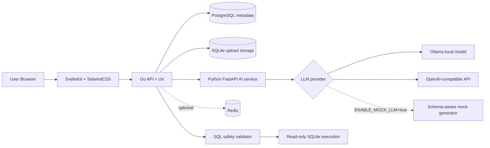

# QueryForge

<p align="center">
  
</p>

<p align="center">
  <strong>An AI-powered SQL workspace for uploaded SQLite databases.</strong>
</p>

<p align="center">
  Connect a SQLite database, inspect the schema, ask natural-language questions, review safe generated SQL, execute read-only queries, and browse query history.
</p>

---

## Table of Contents

- [Overview](#overview)
- [Features](#features)
- [Architecture](#architecture)
- [Tech Stack](#tech-stack)
- [Repository Layout](#repository-layout)
- [Quick Start](#quick-start)
- [Environment Variables](#environment-variables)
- [Running with a Local LLM](#running-with-a-local-llm)
- [Using a Remote OpenAI-Compatible Provider](#using-a-remote-openai-compatible-provider)
- [Running the System](#running-the-system)
- [Using QueryForge](#using-queryforge)
- [Sample SQLite Database](#sample-sqlite-database)
- [API Reference](#api-reference)
- [Security Model](#security-model)
- [Development Workflow](#development-workflow)
- [Testing](#testing)
- [Troubleshooting](#troubleshooting)
- [Future Improvements](#future-improvements)

## Overview

QueryForge is a production-style full-stack application for exploring SQLite databases with an AI-assisted query workflow.

The application is designed around a safe review-and-execute loop:

1. A user registers or logs in.
2. The user creates a workspace.
3. The user uploads a SQLite database file.
4. The Go backend inspects and exposes the schema.
5. The user asks a question in natural language.
6. The Python AI service generates SQL from the question and schema.
7. The backend validates and rewrites SQL through a safety layer.
8. The user executes the read-only query.
9. Results and query history are displayed in the SvelteKit UI.

The AI service is provider-agnostic. By default it uses local Ollama at `http://ollama:11434` with `qwen2.5-coder:7b`, so the app can run without paid API credits. It can also use OpenAI-compatible providers such as OpenAI, Groq, OpenRouter, Together, LM Studio, and LocalAI by changing environment variables.

## Features

- User registration, login, logout, and refresh-token flow.
- JWT access tokens and persisted refresh tokens.
- Password hashing with bcrypt.
- Auth-protected workspace routes.
- Per-user workspace ownership checks.
- SQLite upload support for `.sqlite`, `.sqlite3`, and `.db` files.
- Upload size and extension validation.
- SQLite integrity validation before storing uploaded files.
- Schema inspection with:
  - tables
  - columns
  - column types
  - primary keys
  - foreign keys
  - row counts
- Natural-language to SQL generation through a Python FastAPI service.
- Local Ollama SQL generation by default.
- OpenAI-compatible remote provider support through configurable base URL, model, and optional API key.
- Optional functional mock SQL generation only when `ENABLE_MOCK_LLM=true`.
- Conservative SQL safety validation.
- Read-only SQLite query execution.
- Query timeout handling.
- Query history for generated and executed queries.
- SvelteKit and TailwindCSS developer-tool-style interface.
- Docker Compose for local full-stack orchestration.
- PostgreSQL-backed metadata.
- Optional Redis service included for future cache/session/rate-limit support.

## Architecture



### Service Responsibilities

| Service | Responsibility |
| --- | --- |
| `frontend` | SvelteKit UI for auth, dashboards, schema viewing, query generation, query execution, and history. |
| `backend` | Go HTTP API, auth, authorization, metadata persistence, upload handling, schema inspection, SQL safety, query execution, and AI service integration. |
| `ai-service` | FastAPI service that turns questions plus schema into SQL through Ollama, OpenAI-compatible providers, or an explicitly enabled mock fallback. |
| `postgres` | Stores users, refresh tokens, workspaces, and query history. |
| `redis` | Optional service included for future cache/session/rate-limit features. |

## Tech Stack

| Layer | Technology |
| --- | --- |
| Backend | Go, chi, pgx, bcrypt, JWT |
| Metadata database | PostgreSQL |
| Uploaded/query database | SQLite |
| SQLite driver | `modernc.org/sqlite` |
| AI service | Python, FastAPI, Pydantic, httpx |
| Frontend | SvelteKit, TailwindCSS, lucide-svelte |
| Infrastructure | Docker Compose |

## Repository Layout

```text
queryforge/
  backend/
    cmd/api/main.go
    internal/
      auth/
      config/
      db/
      handlers/
      middleware/
      models/
      repository/
      services/
      sqlsafe/
    migrations/
    testdata/
    Dockerfile
    go.mod
  ai-service/
    app/
      main.py
      prompts.py
      schema_reader.py
      sql_generator.py
    Dockerfile
    requirements.txt
  frontend/
    src/
    static/brand/queryforge-logo.svg
    Dockerfile
    package.json
  docker-compose.yml
  .env.example
  README.md
```

## Quick Start

Prerequisites:

- Docker Desktop or a compatible Docker Engine.
- Docker Compose v2.

Start the full stack:

```bash
cd queryforge
cp .env.example .env
docker compose up --build
```

Open the app:

```text
http://localhost:5173
```

Health checks:

```text
Backend:    http://localhost:8080/health
AI service: http://localhost:8000/health
Frontend:   http://localhost:5173
```

## Environment Variables

Create a local `.env` file from the example:

```bash
cp .env.example .env
```

### Required for Production-Like Use

Change these before using anything beyond local testing:

| Variable | Required | Default | Description |
| --- | --- | --- | --- |
| `JWT_ACCESS_SECRET` | Yes | `change-me-access-secret` | HMAC secret for access tokens. Use a long random value. |
| `JWT_REFRESH_SECRET` | Yes | `change-me-refresh-secret` | HMAC secret for refresh tokens. Use a different long random value. |

Generate local secrets with:

```bash
openssl rand -hex 32
openssl rand -hex 32
```

### Database

| Variable | Required | Default | Description |
| --- | --- | --- | --- |
| `POSTGRES_HOST` | Yes | `postgres` | PostgreSQL hostname. In Docker Compose this must be `postgres`. |
| `POSTGRES_PORT` | Yes | `5432` | PostgreSQL port. |
| `POSTGRES_USER` | Yes | `queryforge` | PostgreSQL user. |
| `POSTGRES_PASSWORD` | Yes | `queryforge` | PostgreSQL password. |
| `POSTGRES_DB` | Yes | `queryforge` | PostgreSQL database name. |

### Ports and URLs

| Variable | Required | Default | Description |
| --- | --- | --- | --- |
| `BACKEND_PORT` | Yes | `8080` | Host port exposed for the Go backend. |
| `FRONTEND_PORT` | Yes | `5173` | Host port exposed for the SvelteKit frontend. |
| `FRONTEND_ORIGIN` | Yes | `http://localhost:5173` | Allowed CORS origin for browser requests. |
| `AI_SERVICE_URL` | Yes | `http://ai-service:8000` | Backend-to-AI-service URL. In Docker Compose this should use the service name `ai-service`. |
| `AI_REQUEST_TIMEOUT_SECONDS` | No | `130` | Backend timeout for calls to the AI service. Keep this above `LLM_TIMEOUT_SECONDS` for slower local models. |
| `VITE_API_URL` | Yes | `http://localhost:8080` | Browser-facing backend URL compiled into the frontend. |

### AI Generation

| Variable | Required | Default | Description |
| --- | --- | --- | --- |
| `LLM_PROVIDER` | Yes | `ollama` | Provider type. Supported values: `ollama`, `openai_compatible`. |
| `LLM_BASE_URL` | Yes | `http://ollama:11434` | Provider base URL. In Docker Compose, Ollama should use `http://ollama:11434`. |
| `LLM_MODEL` | Yes | `qwen2.5-coder:7b` | Model name to use for SQL generation. |
| `LLM_API_KEY` | No | empty | API key for remote providers. Leave empty for local Ollama, LM Studio, or LocalAI when no key is required. |
| `LLM_TIMEOUT_SECONDS` | No | `120` | Timeout for LLM requests. Local models can be slower, so the default is intentionally generous. |
| `LLM_TEMPERATURE` | No | `0.1` | Low temperature keeps SQL generation more deterministic. |
| `ENABLE_MOCK_LLM` | No | `false` | Enables the schema-aware mock fallback. Keep false when testing real providers. |

### Storage and Uploads

| Variable | Required | Default | Description |
| --- | --- | --- | --- |
| `STORAGE_DIR` | Yes | `/app/storage` | Container path where uploaded SQLite files are stored. |
| `MAX_UPLOAD_MB` | No | `50` | Maximum uploaded SQLite file size in megabytes. |

## Running with a Local LLM

QueryForge defaults to Ollama so it can run without paid API credits.

### 1. Install Ollama

macOS:

```bash
brew install ollama
```

You can also install Ollama from:

```text
https://ollama.com
```

### 2. Start Ollama

For a host Ollama install:

```bash
ollama serve
```

For the default Docker Compose setup, QueryForge starts an `ollama` container instead. Inside the Docker network it is available at:

```text
http://ollama:11434
```

### 3. Pull a Model

Recommended default:

```bash
ollama pull qwen2.5-coder:7b
```

If you use the Docker Compose `ollama` service, start the stack once and pull the model into the compose volume:

```bash
docker compose up -d ollama
docker compose exec ollama ollama pull qwen2.5-coder:7b
```

The helper script handles both cases. If the compose `ollama` service is running, it pulls into the Docker volume; otherwise it checks the local `ollama` CLI and pulls into the host Ollama install:

```bash
cd queryforge
./scripts/pull-local-model.sh
```

The script reads `LLM_MODEL` from `.env` and defaults to `qwen2.5-coder:7b`.

### 4. Configure `.env`

```env
LLM_PROVIDER=ollama
LLM_BASE_URL=http://ollama:11434
LLM_MODEL=qwen2.5-coder:7b
LLM_API_KEY=
LLM_TIMEOUT_SECONDS=120
LLM_TEMPERATURE=0.1
AI_REQUEST_TIMEOUT_SECONDS=130
```

### 5. Run the App

```bash
docker compose up --build
```

### Recommended Local Models

| Model | Use Case |
| --- | --- |
| `qwen2.5-coder:3b` | Weak machines or quick tests. |
| `qwen2.5-coder:7b` | Recommended default balance of speed and SQL/code quality. |
| `llama3.1:8b` | General-purpose local alternative. |
| `qwen2.5-coder:14b` | Stronger machines where quality matters more than latency. |

7B-style models are a good balance of speed and quality for local SQL generation. Local models may be slower than hosted APIs, but they avoid API cost and keep prompts local. Regardless of provider, every generated query still goes through the Go backend SQL safety validator before execution.

### Test the Local Provider

```bash
./scripts/test-llm-provider.sh "Say hello from QueryForge"
```

When this script runs from the host and sees `LLM_BASE_URL=http://ollama:11434`, it automatically tests against `http://localhost:11434`, which is the port exposed by the compose `ollama` service.

## Using a Remote OpenAI-Compatible Provider

Use `openai_compatible` for OpenAI, Groq, OpenRouter, Together, LM Studio, LocalAI, or any provider exposing a chat-completions-compatible API.

```env
LLM_PROVIDER=openai_compatible
LLM_BASE_URL=https://api.example.com/v1
LLM_MODEL=some-model
LLM_API_KEY=some-key
LLM_TIMEOUT_SECONDS=120
LLM_TEMPERATURE=0.1
```

OpenAI example:

```env
LLM_PROVIDER=openai_compatible
LLM_BASE_URL=https://api.openai.com/v1
LLM_MODEL=gpt-4o-mini
LLM_API_KEY=your-api-key
```

Local OpenAI-compatible servers such as LM Studio or LocalAI often do not require an API key:

```env
LLM_PROVIDER=openai_compatible
LLM_BASE_URL=http://host.docker.internal:1234/v1
LLM_MODEL=local-model-name
LLM_API_KEY=
```

If `LLM_API_KEY` is empty, QueryForge does not send an `Authorization` header.

## Running the System

### Start in the Foreground

```bash
cd queryforge
docker compose up --build
```

### Start in the Background

```bash
cd queryforge
docker compose up --build -d
```

### Check Service Status

```bash
cd queryforge
docker compose ps
```

### Follow Logs

```bash
cd queryforge
docker compose logs -f
```

Logs for one service:

```bash
docker compose logs -f backend
docker compose logs -f frontend
docker compose logs -f ai-service
docker compose logs -f postgres
```

### Stop Services

```bash
cd queryforge
docker compose down
```

### Stop Services and Delete Data Volumes

This deletes PostgreSQL metadata and uploaded SQLite files stored in Docker volumes.

```bash
cd queryforge
docker compose down -v
```

### Rebuild From Scratch

```bash
cd queryforge
docker compose down -v
docker compose up --build
```

## Using QueryForge

1. Open `http://localhost:5173`.
2. Register a new account.
3. Create a workspace.
4. Upload a `.sqlite`, `.sqlite3`, or `.db` file.
5. Inspect the schema in the left panel.
6. Ask a natural-language question, for example:

```text
Show me the top 10 customers by total revenue
```

7. Review the generated SQL.
8. Click Execute.
9. Inspect the result table and query history.

## Sample SQLite Database

A seed script is included:

```text
backend/testdata/create_sample_store.sql
```

Create a sample SQLite file locally:

```bash
cd queryforge
sqlite3 backend/testdata/sample_store.sqlite < backend/testdata/create_sample_store.sql
```

Upload `backend/testdata/sample_store.sqlite` from the workspace detail page.

Sample tables:

- `customers`
- `products`
- `orders`
- `order_items`

## API Reference

All protected endpoints require:

```http
Authorization: Bearer <access_token>
```

Errors are returned consistently:

```json
{
  "error": "message"
}
```

### Health

| Method | Path | Auth | Description |
| --- | --- | --- | --- |
| `GET` | `/health` | No | Backend health check. |
| `GET` | `/api/ai/health` | Yes | Proxied AI service health with provider, model, and base URL. |

The AI service also exposes:

| Method | Path | Auth | Description |
| --- | --- | --- | --- |
| `GET` | `http://localhost:8000/health` | No | AI service health and configured public provider metadata. |
| `POST` | `http://localhost:8000/test-llm` | No | Sends a small test message to the configured LLM provider. |

### Auth

| Method | Path | Auth | Description |
| --- | --- | --- | --- |
| `POST` | `/api/auth/register` | No | Register a user and return tokens. |
| `POST` | `/api/auth/login` | No | Log in and return tokens. |
| `POST` | `/api/auth/refresh` | No | Rotate refresh token and return a new token pair. |
| `POST` | `/api/auth/logout` | No | Revoke a refresh token. |

Register:

```bash
curl -X POST http://localhost:8080/api/auth/register \
  -H 'Content-Type: application/json' \
  -d '{"name":"Ada Lovelace","email":"ada@example.com","password":"password123"}'
```

Login:

```bash
curl -X POST http://localhost:8080/api/auth/login \
  -H 'Content-Type: application/json' \
  -d '{"email":"ada@example.com","password":"password123"}'
```

Refresh:

```bash
curl -X POST http://localhost:8080/api/auth/refresh \
  -H 'Content-Type: application/json' \
  -d '{"refresh_token":"<refresh_token>"}'
```

Logout:

```bash
curl -X POST http://localhost:8080/api/auth/logout \
  -H 'Content-Type: application/json' \
  -d '{"refresh_token":"<refresh_token>"}'
```

### Workspaces

| Method | Path | Auth | Description |
| --- | --- | --- | --- |
| `GET` | `/api/workspaces` | Yes | List the current user's workspaces. |
| `POST` | `/api/workspaces` | Yes | Create a workspace. |
| `GET` | `/api/workspaces/{id}` | Yes | Get one owned workspace. |
| `DELETE` | `/api/workspaces/{id}` | Yes | Delete one owned workspace. |
| `POST` | `/api/workspaces/{id}/upload` | Yes | Upload a SQLite database file. |
| `GET` | `/api/workspaces/{id}/schema` | Yes | Inspect uploaded SQLite schema. |

Create workspace:

```bash
curl -X POST http://localhost:8080/api/workspaces \
  -H "Authorization: Bearer $ACCESS_TOKEN" \
  -H 'Content-Type: application/json' \
  -d '{"name":"Store Analytics"}'
```

Upload SQLite:

```bash
curl -X POST http://localhost:8080/api/workspaces/$WORKSPACE_ID/upload \
  -H "Authorization: Bearer $ACCESS_TOKEN" \
  -F "file=@backend/testdata/sample_store.sqlite"
```

Read schema:

```bash
curl http://localhost:8080/api/workspaces/$WORKSPACE_ID/schema \
  -H "Authorization: Bearer $ACCESS_TOKEN"
```

### Query Generation and Execution

| Method | Path | Auth | Description |
| --- | --- | --- | --- |
| `POST` | `/api/workspaces/{id}/query/generate` | Yes | Generate SQL from a natural-language question. |
| `POST` | `/api/workspaces/{id}/query/execute` | Yes | Validate and execute read-only SQL. |

Generate SQL:

```bash
curl -X POST http://localhost:8080/api/workspaces/$WORKSPACE_ID/query/generate \
  -H "Authorization: Bearer $ACCESS_TOKEN" \
  -H 'Content-Type: application/json' \
  -d '{"question":"Show me the top 10 customers by total revenue"}'
```

Response:

```json
{
  "sql": "SELECT ... LIMIT 10",
  "explanation": "Mock generator recognized a customer revenue ranking...",
  "confidence": 0.74
}
```

Execute SQL:

```bash
curl -X POST http://localhost:8080/api/workspaces/$WORKSPACE_ID/query/execute \
  -H "Authorization: Bearer $ACCESS_TOKEN" \
  -H 'Content-Type: application/json' \
  -d '{"sql":"SELECT id, name FROM customers LIMIT 10"}'
```

Response:

```json
{
  "columns": ["id", "name"],
  "rows": [[1, "Alice Johnson"]],
  "row_count": 1,
  "execution_ms": 3
}
```

### Query History

| Method | Path | Auth | Description |
| --- | --- | --- | --- |
| `GET` | `/api/workspaces/{id}/history?limit=25&offset=0` | Yes | Paginated query history for one workspace. |
| `GET` | `/api/history/{historyId}` | Yes | One owned history item. |

List history:

```bash
curl "http://localhost:8080/api/workspaces/$WORKSPACE_ID/history?limit=25&offset=0" \
  -H "Authorization: Bearer $ACCESS_TOKEN"
```

## Security Model

### Authentication

- Passwords are hashed with bcrypt.
- Access tokens are short-lived JWTs.
- Refresh tokens are JWTs stored as SHA-256 hashes in PostgreSQL.
- Refresh tokens are rotated on refresh.
- Logout revokes the supplied refresh token.

### Authorization

- Workspaces are always queried by both `user_id` and `workspace_id`.
- Query history is scoped to the authenticated user.
- API responses do not expose full filesystem paths for uploaded databases.

### Upload Safety

- Only `.sqlite`, `.sqlite3`, and `.db` extensions are accepted.
- Upload size is capped by `MAX_UPLOAD_MB`.
- Uploaded SQLite files are opened and checked with SQLite integrity validation.
- Files are stored under per-user and per-workspace directories.

### SQL Safety

The backend validates generated and user-edited SQL before execution.

Allowed:

- `SELECT`
- `WITH` queries that are read-only

Rejected:

- `INSERT`
- `UPDATE`
- `DELETE`
- `DROP`
- `ALTER`
- `TRUNCATE`
- `CREATE`
- `ATTACH`
- `DETACH`
- `PRAGMA`
- `VACUUM`
- `REINDEX`
- comments
- multiple statements

Additional protections:

- A default `LIMIT 100` is added when no limit is present.
- Limits above `500` are capped to `500`.
- SQLite connections are opened read-only.
- Query execution uses context timeouts.

## Development Workflow

### Backend

```bash
cd queryforge/backend
go test ./...
go run ./cmd/api
```

For local non-Docker backend development, set PostgreSQL and AI service environment variables so the backend can reach those services.

### AI Service

```bash
cd queryforge/ai-service
python3 -m venv .venv
source .venv/bin/activate
pip install -r requirements.txt
uvicorn app.main:app --reload --host 0.0.0.0 --port 8000
```

### Frontend

```bash
cd queryforge/frontend
npm install
npm run dev
```

The frontend reads the browser-facing API URL from:

```env
VITE_API_URL=http://localhost:8080
```

## Testing

Backend tests:

```bash
cd queryforge/backend
go test ./...
```

Frontend production build:

```bash
cd queryforge/frontend
npm install
npm run build
```

AI service tests:

```bash
cd queryforge/ai-service
pytest -q
```

Docker Compose validation:

```bash
cd queryforge
docker compose config
docker compose up --build
```

## Troubleshooting

### `docker compose up --build` cannot bind a port

Another process is already using one of the exposed ports. Change the port in `.env` or stop the process.

Common ports:

```text
Frontend: 5173
Backend:  8080
AI:       8000
Postgres: 5432
Redis:    6379
```

### Frontend cannot reach the backend

Check:

- `VITE_API_URL` points to the browser-accessible backend URL, usually `http://localhost:8080`.
- `FRONTEND_ORIGIN` matches the frontend origin, usually `http://localhost:5173`.
- The backend is healthy:

```bash
curl http://localhost:8080/health
```

### AI generation fails because the model is missing

For local Ollama, pull the configured model first:

```bash
./scripts/pull-local-model.sh
```

If you are using the compose `ollama` service directly:

```bash
docker compose up -d ollama
docker compose exec ollama ollama pull qwen2.5-coder:7b
```

Then restart the app:

```bash
docker compose down
docker compose up --build
```

### AI generation uses the mock generator

The mock is only used when:

```env
ENABLE_MOCK_LLM=true
```

Set it to `false` when testing real Ollama or OpenAI-compatible providers.

### Uploaded database is rejected

Check:

- File extension is `.sqlite`, `.sqlite3`, or `.db`.
- File size is below `MAX_UPLOAD_MB`.
- The file is a valid SQLite database.

### Reset all local data

```bash
cd queryforge
docker compose down -v
docker compose up --build
```

## Screenshots

Screenshots can be added here after running the app locally.

Suggested screenshots:

- Login page
- Dashboard
- Workspace upload state
- Schema explorer
- Query console with generated SQL
- Results table and query history

## Future Improvements

- Streaming SQL generation.
- Result export to CSV.
- Saved prompts and pinned queries.
- Team workspaces and role-based access control.
- Query explain plans and index hints.
- More SQL dialects with dialect-specific validators.
- Redis-backed rate limiting.
- Better LLM prompt telemetry and generation traces.
- File lifecycle cleanup for deleted workspaces.
- End-to-end browser tests.
